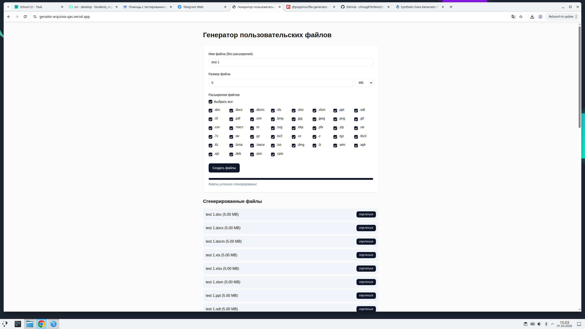

# Задание 5. Тестовые данные

## 1. Ресурсы для генерации файлов различного размера

Для проверки ограничений загрузки файлов были найдены следующие ресурсы:

1. Gerador de Arquivos para Testes** - https://gerador-arquivos-qas.vercel.app/
   (Веб-инструмент для создания файлов любого размера и формата. Использован в данном задании.)

2. https://dummyfilegenerator.com/
   Позволяет генерировать файлы различного размера для тестирования ограничений загрузки.

Оба ресурса являются рабочими и позволяют создавать файлы конкретного размера.

## 2. Ресурсы для генерации тестовых данных

Для заполнения форм валидными пользовательскими данными были использованы следующие ресурсы:

1. https://www.fakenamegenerator.com/
   Генерирует:
   - ФИО
   - Телефон
   - Email
   - Адрес
   - Возможность выбора страны

2. https://randomuser.me/
   Генерирует:
   - ФИО
   - Телефон
   - Email
   - Адрес
   - Национальность

Оба ресурса позволяют получать корректные тестовые данные для проверки форм.

## 3. Тестовые файлы для проверки загрузки аватара (лимит 5 МБ) https://gerador-arquivos-qas.vercel.app/

### Файл 1 (негативный, меньше лимита) - 1 МБ
*   **Ожидаемый результат:** Успешная загрузка (файл проходит по размеру)
*   **Процесс генерации:** Введен размер 1 МБ, выбраны все форматы
*   **Скриншот процесса:**
    

### Файл 2 (граничное значение) - 5 МБ
*   **Ожидаемый результат:** Успешная загрузка (ровно по лимиту)
*   **Процесс генерации:** Введен размер 5 МБ, выбраны все форматы
*   **Скриншот процесса:**
    

### Файл 3 (негативный, превышение) - 6 МБ
*   **Ожидаемый результат:** Ошибка "Файл превышает допустимый размер"
*   **Процесс генерации:** Введен размер 6 МБ, выбраны все форматы
*   **Скриншот процесса:**
    

Скриншоты размеров файлов приложены отдельно.

## 4. Сгенерированные тестовые пользователи (страна: Австралия)

Источник генерации: https://www.fakenamegenerator.com/
Выбрана страна: Australia

### Пользователь 1
- ФИО: Liam Anderson
- Телефон: +61 412 345 678
- Email: liam.anderson@example.com
- Адрес: 25 King Street, Sydney, NSW 2000

### Пользователь 2
- ФИО: Olivia Brown
- Телефон: 0413 987 654
- Email: olivia.brown@example.com
- Адрес: 14 Collins Street, Melbourne, VIC 3000

### Пользователь 3
- ФИО: Noah Wilson
- Телефон: +61 423 111 222
- Email: noah.wilson@example.com
- Адрес: 8 Adelaide Street, Brisbane, QLD 4000

### Пользователь 4
- ФИО: Ava Taylor
- Телефон: 0425 555 333
- Email: ava.taylor@example.com
- Адрес: 3 Murray Street, Perth, WA 6000

### Пользователь 5
- ФИО: Jack Thompson
- Телефон: +61 418 222 999
- Email: jack.thompson@example.com
- Адрес: 19 North Terrace, Adelaide, SA 5000

## 5. Проверка соответствия форматов стандартам Австралии

### 5.1 Проверка формата телефонов

Стандарт мобильных номеров Австралии:

- Локальный формат: 04XX XXX XXX
- Международный формат: +61 4XX XXX XXX

Все представленные номера соответствуют указанным форматам:
- начинаются с 04 (локальный формат)
- либо с +61 4 (международный формат)

### 5.2 Проверка формата адресов

Стандартный формат адреса в Австралии:

Номер дома и улица
Город, Аббревиатура штата Почтовый индекс

Пример:
Sydney, NSW 2000

Использованные аббревиатуры штатов:
- NSW — New South Wales
- VIC — Victoria
- QLD — Queensland
- WA — Western Australia
- SA — South Australia

Все адреса содержат:
- номер дома и улицу
- город
- корректную аббревиатуру штата
- 4-значный почтовый индекс

Форматы соответствуют стандартам Австралии.

## Вывод

1. Найдены рабочие ресурсы для генерации файлов различного размера.
2. Найдены ресурсы для генерации тестовых пользовательских данных.
3. Проведено тестирование ограничения загрузки файла размером 5 МБ (позитивные и негативный сценарии).
4. Сгенерированы тестовые пользователи для Австралии.
5. Проверено соответствие форматов телефонов и адресов установленным стандартам страны.
